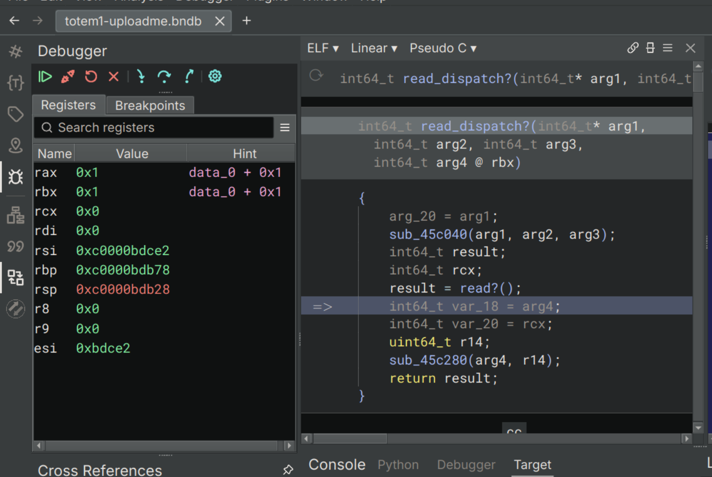
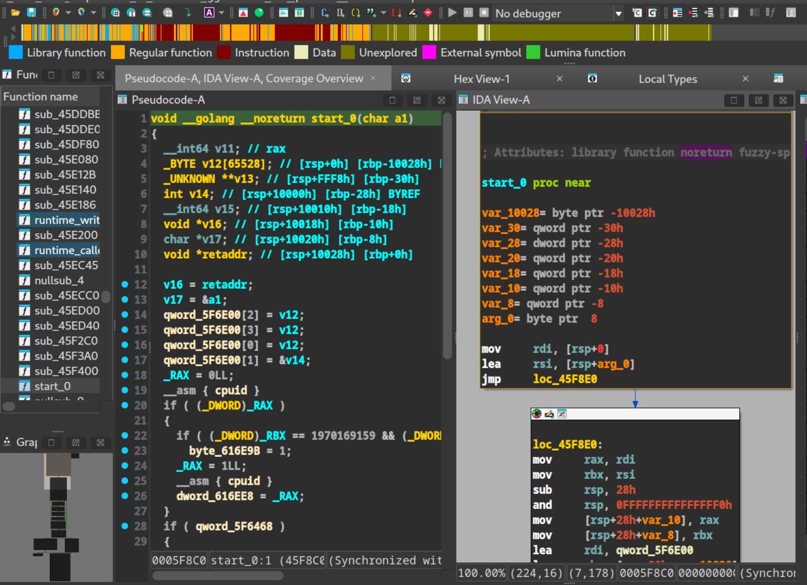
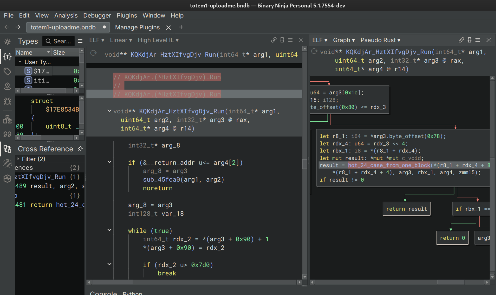

# DEFCON Quals - Totem

## Description

Have Fun!

# ACT_0x01: Go(lang) away

DEFCON Quals, my favorite time of year! So when I first looked at this challenge I was curious as to the lack of description, so I took a shot at it and ended up solving it, then later on coming back to it because of how interesting the concept was.

So our holy trinity of reversing challenges (file, strings, run that ish) gave us the following:

```
≻ file totem1-uploadme
totem1-uploadme: ELF 64-bit LSB executable, x86-64, version 1 (SYSV), statically linked, stripped
```

Yayyy stripped and statically linked binary. Super excited to use IDA Pro's FLIRT signatures and Binja's signatures to try and reapply some symbols to everything, which should lower the pain. Can we get a hint on what we're working with? Strings is up:

```
≻ strings totem1-uploadme

...big ass snip

_Lb%
	;~"
HI6.
qKguDid
.text
.noptrdata
.data
.bss
.noptrbss
.go.fuzzcntrs
.go.buildinfo
.go.fipsinfo
.elfdata
.rodata
.typelink
.itablink
.gosymtab
.gopclntab
.shstrtab
```

Oh... Go reversing lol, we get that idea from the various sections that we see that have `go` in them like `.gosymtab, .gopclntab`, etc. 

And now we try to run it:

```
≻ ./totem1-uploadme 
Enter the flag: 
```

Oh I was scared for nothing, it's just a basic flag checker, probably just checking it inside of its memory, so all we have to do is put a breakpoint during execution to see the flag and we're off with the races! (Totally not foreshadowing). Oh, also since this had text for flag, might as well strings and grep it to see if there's something I can search for.

```
≻ strings totem1-uploadme | rg -C 3 flag
..heavy snip
flag
tChanSendflagtyp_truereadsync
Go code set up signal handler without SA_ONSTACK flag
muwfxQU5I/cpuflags_amd64.go
```

That's weird, I just saw flag text but nothing in the actual program? I'll keep that in mind I guess.

## This'll be eaaaasy

Okay, I'll skip the amount of time this binary took to analyze in both IDA and Binja >.>, but trust me it took forever. We're also going to use Mandiant's [GoReSym tool](https://github.com/mandiant/GoReSym) to at least try and bring back some symbols into this gods forsaken binary.

Anyways, immediately upon entering, there's obviously no main function, and it'd be a pain trying to statically figure it out, especially with huge program sections like this:


So instead, let's try out Binja's debugger! That way we can at least see where main is, so first let's start off in a breakpoint we set at the very beginning of the program and follow the program execution to the main method and go from there. Ideally we can find where this program attempts to compare the in memory flag and it's GG. 

 

So after letting the program continue until we reached the input section, I see the 'Enter the Flag: ' string. The inner read call just calls a wrapped syscall as well. Interesting thing is once we attempt to look into that `sub_45c280` function, it's pretty huge, so I assume it's related to the runtime or something similar. 



Actually, the really interesting thing is that when I try work backwards from our known read and check the cross references of these calls, they're not really associated with anything central, almost like these are functions that are dynamically used or something, which is pretty painful. Honestly? Tracing all of this is just not feasible, I need to narrow down our search space and focus on actually useful sections of code so I can at least make sense of what I'm looking at. In that case, we have a couple options to pick from, and I know that Frida doesn't work well with statically linked binaries, and Angr won't really work well if I don't know what it is that I'm looking for, and I don't even know what main looks like yet >:|. Which leaves us with one last (there's more) trick up my sleeve... Lighthouse!

## Let there be LIGHT(house)

So [Lighthouse](https://github.com/gaasedelen/lighthouse) is a code coverage exploration tool, basically I run the program using a special utility, and all the stuff that was ran gets lit up like... well, a lighthouse. The reason I'm doing this is because I really don't have the time to painstakingly analyze something as massive as a statically compiled binary, and we need to narrow down what we look at.

To start, we'll create a code coverage file with [DynamoRIO](https://dynamorio.org/), a **massive** dynamic instrumentation framework that just so happens to include a tool to create code coverages (and the Lighthouse docs said to use it xd)! As for how I learned about Lighthouse, well I get bored and scroll through the Binja plugins list and found this banger. Anyways, let's generate the coverage file like so and get an incorrect path:

```
$ ~/Tools/DynamoRIO-Linux-11.3.0-1/bin64/drrun -t drcov -- ./totem1-uploadme
Enter the flag: b
Sorry, that's not right.
$ ls
drcov.totem1-uploadme.738120.0000.proc.log
totem1-uploadme
..snip
```

Once we got this we load it into IDA or Binja and we're off to the races!

**Note:** At the time of release, Lighthouse doesn't work on the newest versions of Binja so I'm going to use IDA Pro to show this, but it'll still work on older versions.

So once we load the coverage file, we're met with a huge amount of information about what **actually** ran within our program, which is an absolute lifesaver when it comes to this type of analysis (Also I did apply some FLIRT signatures on this to get some of Golangs functions auto renamed).

Before:


After:


## Hot functions near you

So now we get to see the most used areas of the program, which leads us to this function `sub_512200`! What's there? Great question, it doesn't even fit on my screen so you're gonna get a picture of the big ass execution graph. Let's lovingly rename that to `hot_calls_near_me`.


What I can see is that this is an absolutely massive switch statement of 10 separate cases, most of which was heavily touched during execution. After that we can see `sub_5105A0` has a similar switch statement of 24 cases, so still absolutely massive thing to analyze, We'll rename **that** to `hot_24_case_from_one_block`. Normally I'd try to fully decompile and understand what's going on but this is DEFCON Quals, so I'm on a time crunch.


The first `hot_calls_near_me` function doesn't make any immediate sense in IDA, but after switching over to Binja, I see a VERY interesting string:


Perfect!!! So we can assume that this super hot block is our flag check function or something similar, great! Let's rename this function to `flag_checker`. After that, let's glance over at the `hot_24_case_from_one_block` area to see if we can glean some information about what else the program does, the reason being that the program was called `totem1` and I'm assuming that there'll be more versions derived from this program and I haven't really found the niche for this challenge yet.

## Found the Niche

So, immediately looking at this section of code doesn't immediately trigger any PTSD, at least until I come across this section here:


This looks a bit interesting, especially the `arg5[0x1c] += 1`. After looking through all 24 different switch cases, they all pretty much increment this specific offset in whatever structure `arg5` is. Now, by this time, we've gotten enough information on the binary to just start doing dynamic analysis with the correct areas in memory. However, something in the back of my brain asked one simple question- what's calling this function? And after scrolling to the function signature and checking the Xrefs, I noticed something...

Staring me right in the face was a renamed function, in fact it was one of the functions renamed by GoReSym.



One of the few renamed functions was mangled, but had an actual name at the end `KQKdjAr.(*HztXIfvgDjv).Run`. What ran that you might ask?


I've seen that pattern before time and time again. That configuration of `arg5[some_specific_offset] += 1` haunts my dreams and fuels my nights with stacks of monster energy drinks and yerba mates. Lads, we might be reversing a **virtual machine**.

How do we know? Well, a couple of patterns stand out but if you've never written an emulator for a CPU, tinkered with an NES, or come across this exact type of challenge before [definitely read about it](https://bugzmanov.github.io/nes_ebook/chapter_3_1.html)! I won't go too in depth here, but the basic gist is this:

```rust
pub fn interpret(&mut self, program: Vec<u8>) {
    self.program_counter = 0;

    loop {
        let opscode = program[self.program_counter as usize];
        self.program_counter += 1;

        match opscode {
            Opcodes::NOP => self.program_counter += 1,
            _ => todo!("Other opcodes go here!")
        }
    }
}
```

Usually, you'll have a function that reads the loaded memory of your virtual machine one instruction at a time, then execute the instructions it comes across.

