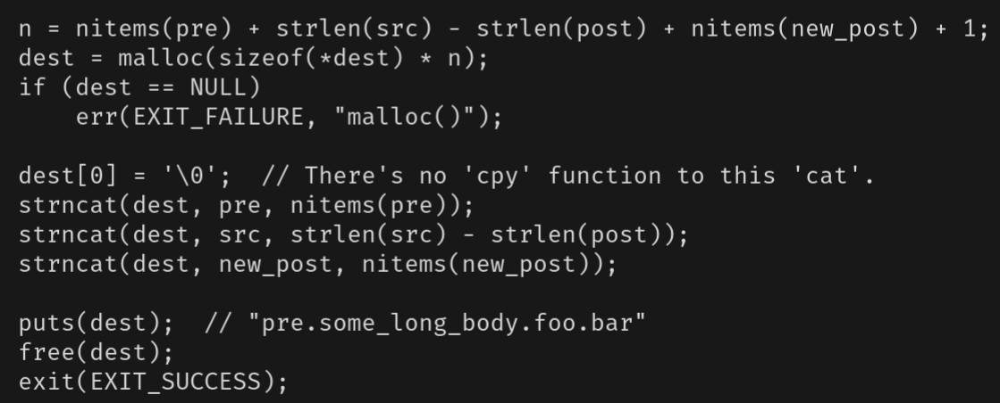
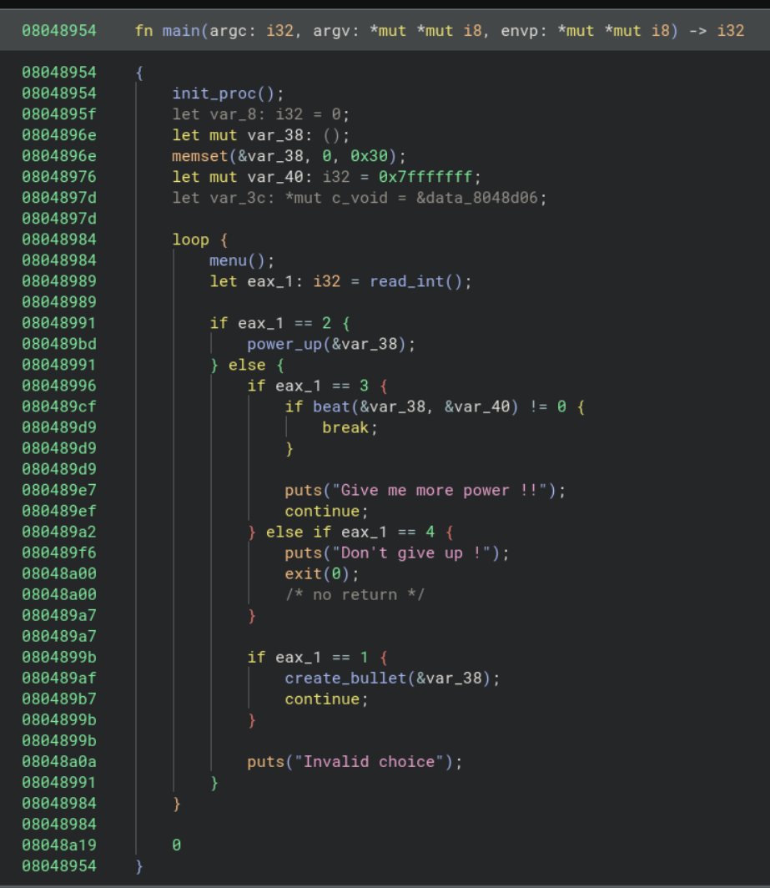
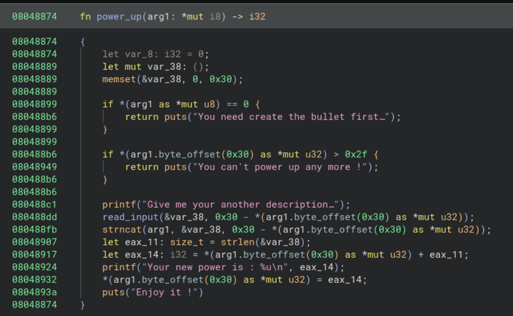
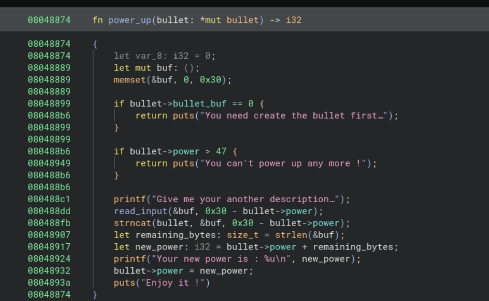

# Pwnable TW - Silver Bullet

## Description

Please kill the werewolf with silver bullet!

`nc chall.pwnable.tw 10103`

# ACT_0x01: What Do?

Alright! So to start off our challenge, let's just do the classic holy combo of `file`, `checksec`, and also just running the damn thing. Oh, and a little tool I came across called `cwe_checker`, PITA to install, but super cool when it works! Also, I can't run the damn thing, so I'll also be using `pwninit` to set up my exploit environment and auto patch the binary. Saves so much time.

## file:
```
$> file silver_bullet

silver_bullet: ELF 32-bit LSB executable, Intel 80386, version 1 (SYSV), dynamically linked, interpreter /lib/ld-linux.so.2, for GNU/Linux 2
.6.32, BuildID[sha1]=8c95d92edf8bf47b6c9c450e882b7142bf656a92, not stripped
```
The actually useful parts of this are the `not stripped`, the `32-bit` part. Also whether or not it's dynamically or statically linked.

So far we have an unstripped 32-bit executable. Only reason I care about the 32-bit part is in case we come across a vuln that requires bruteforcing an address. 64-bit makes the bruteforce process take longer than the heat death of the universe so best to avoid that.

## checksec:

```HS
[*] '/home/exiled/Desktop/ctf/pwnable_tw/silvery_2/silver_bullet'
    Arch:       i386-32-little
    RELRO:      Full RELRO
    Stack:      No canary found
    NX:         NX enabled
    PIE:        No PIE (0x8048000)
    Stripped:   No
```
Full RELRO, but no canary, PIE/ASLR, and we get symbols. Wack.

Quick recap on what full RELRO is, it just relocates the GOT section and also makes it read-only. Proof in case you don't [believe me](https://www.redhat.com/en/blog/hardening-elf-binaries-using-relocation-read-only-relro).

The important excerpts are as follows:
> Firstly, PLT needs to be located at a fixed offset from the .text section. Secondly, since GOT contains data used by different parts of the program directly, it needs to be allocated at a known static address in memory. Lastly, and more importantly, because the GOT is lazily bound it needs to be writable. -SNIP-

Basically Full RELRO makes overwriting this GOT impossible, although targeting the .fini array, free/malloc hook overwrites, ROP, and most other attacks are all still on the table :3.


## Running it:

```
+++++++++++++++++++++++++++
       Silver Bullet
+++++++++++++++++++++++++++
 1. Create a Silver Bullet
 2. Power up Silver Bullet
 3. Beat the Werewolf
 4. Return
+++++++++++++++++++++++++++
Your choice :
```

All hail our lord and savior menu chal! Anyways, we'll figure out what the menus do in a sec. Oh, btw I'm using `pwninit` to actually be able to run this binary, because I'm too lazy to actually learn to use a docker pwn environment.

## CWE Checker

Aight, this one doesn't always work so ¯\\\_(ツ)_\/¯ 

```C
>$ cwe_checker silver_bullet

[CWE676] (0.1) (Use of Potentially Dangerous Function) create_bullet (08048840) -> strlen
[CWE676] (0.1) (Use of Potentially Dangerous Function) power_up (08048889) -> memset
[CWE676] (0.1) (Use of Potentially Dangerous Function) power_up (080488fb) -> strncat
[CWE676] (0.1) (Use of Potentially Dangerous Function) power_up (08048907) -> strlen
[CWE676] (0.1) (Use of Potentially Dangerous Function) main (0804896e) -> memset
```

Oh sick it actually did something. Okay so I'll start off by mainly looking at the `power_up` and `create_bullet` functions. Mainly due to the fact that simply touching a string in C is practically undefined behavior xd. What specifically catches my eye here is the `strncat` call, since why tf would you use `strncat` over just `snprintf`. Also, string manipulation in C is pretty shit, and people always suck at remembering the null byte, or they miscalculate the length, mess up their buffer, etc. The list goes on.

Tbh I forgot what `strncat` does anyways so lets pull up the man pages to refresh our mind palaces.

## Boring but useful reading...

```C
$> man strncat

Blah blah, synopsis, blah blah description, blah blah examples


Synopsis

char *strncat(char *restrict dst, const char src[restrict .ssize],
                     size_t ssize);

Return value

strncat returns dst

..snip..
```

And description (cut for usefulness):

Blah blah, function appends bytes from the array pointed to by src, followed by a null character, **to the end of the string pointed to by dst**.  dst must point to a string contained in a buffer that is large enough, that is, **the  buffer  size must be at least strlen(dst) + strnlen(src, ssize) + 1**.

Bruh, no wonder people screw the function up, tf is this buffer length requirement... wdym the buffer size must be at least `strlen(dst) + strnlen(src, ssize) + 1`.

So you gotta make sure that the `strlen != ssize` otherwise the null byte overwrites `dst` by one... bruh. Anyways, lets run the rest of the program then finally load it into your preferred decompiler.

Nah I'm not done clowning on this, what even is this example.



## The last part of recon I swear.

Okay, finally lets just see the last menus.

### Menu 1: Make it
```C
+++++++++++++++++++++++++++
       Silver Bullet
+++++++++++++++++++++++++++
 1. Create a Silver Bullet
 2. Power up Silver Bullet
 3. Beat the Werewolf
 4. Return
+++++++++++++++++++++++++++
Your choice :1
Give me your description of bullet :rawrxd
Your power is : 6
Good luck !!
```

Aight, so place for user input and the "power" is the length of our input.

### Menu 2: UNLIMITED POWERRRR

```C
+++++++++++++++++++++++++++
       Silver Bullet
+++++++++++++++++++++++++++
 1. Create a Silver Bullet
 2. Power up Silver Bullet
 3. Beat the Werewolf
 4. Return
+++++++++++++++++++++++++++
Your choice :2
Give me your another description of bullet :uwu
Your new power is : 9
Enjoy it !
```

Aight, so the second menu adds N, N+1 input lengths together (confirmed b/c I added "booga" and got a power of 14).

### Menu 3: Beat it

```C
+++++++++++++++++++++++++++
       Silver Bullet
+++++++++++++++++++++++++++
 1. Create a Silver Bullet
 2. Power up Silver Bullet
 3. Beat the Werewolf
 4. Return
+++++++++++++++++++++++++++
Your choice :3
>----------- Werewolf -----------<
 + NAME : Gin
 + HP : 2147483647
>--------------------------------<
Try to beat it .....
Sorry ... It still alive !!
Give me more power !!
```

Aight, does some random stuff and the "werewolf" has INT_MAX health.

That's a thicc boi.

Aight, lets load up binja.

# ACT_0x02: REEEV YOUR ENGIIIINES

## Main


Yes, I do use the Rust IL in Binja, why? Because it's nice. Actual reason is because of explicit mut/non mut, easy differentiation of signed vs unsigned datatypes and return types, loop being better than BS while loops, match ergonomics, etc.

Aight, we got main here, the `init_proc` function is just classic [CTF buffering setup](https://www.reddit.com/r/ExploitDev/comments/in5mpl/setvbufsetbuf_calls/), so we don't care. The rest is just a classic menu challenge, nothing interesting yet.

Only thing we see is that `var_40` variable that gets passed into `beat`. Currently the functions we care about in order are: `power_up`, `create_bullet`, `beat`

## Power Up



Hmm, aight so from the top, the memorable parts I immediately see are:

- `arg1` is definitely a struct, of at least size `0x30`. Binja makes auto structs but for the Ghidra and (surprisingly) Ida users I'll set up what I think the struct is in a sec.
- We have to create the bullet first before powering up
- After making a bullet with random user input we can use `power_up` to add another description, from there we use the `read_input` func into that `var_38` buffer based off the remaining power of our `arg1` struct.
- ❗ Ayo, now we `strncat` into that `var_38` buffer where the size is based off our remaining power.

    - What makes this fishy is that we control the bytes given into `arg1` when we first create the object... 

Okay lets rename some stuff and make the struct for the powered up thingie.

### Upgrades People, Upgrades

First let's take care of the struct definition, based off the null check on `if *(arg1 ..) == 0`, and since the creation of a bullet requires us to give a bullet description, I'm gonna go out on a limb and say that `arg1->offset(0)` is the beginning of our description `bullet_buf`. And since we read `0x30` bytes into our bullet description, let's just assume that's the size.

Last part is `arg1->offset(0x30)`, this part's checked to make sure that it's below 48 (0x30 in hex), and considering the `puts` string talking about increasing power, we'll just go ahead and assume that it's just an int. So altogether we got:

```c
struct bullet {
    char[30] bullet_buf;
    int power;
}
```


Much better 😌.

### Strncat? More like, uhhh...

Aight, so to recap:

- We control the initial bullet power and buffer contents.
- ❗ Strncat absolutely sucks because you gotta make sure that the `strlen(str) != size_n`, otherwise you get rekt by the null byte that `strncat` writes at the end. Or, for the rustaceans, `bullet.byte_offset(0x30) + 1 = 0x0`.
- As long as we don't crash the program, if we somehow get rid of the null byte at the end of our bullet buffer, we'll probably get a massive power, since `strlen` keeps going until it bumps into a terminating null byte.
- The bullet power gets set again after our string tomfoolery.

Anyways, let's take a closer look at this line again since I'm almost 90% sure this is the initial vuln.

`strncat(bullet, &buf, 0x30 - bullet->power);`

So if our bullet creation input is `rawrxd`, the `bullet->power` is 6, after that we have an `ssize` of `0x30 - 6 = 0x2a`.

Upon entering the `power_up` function, that strncat will basically be

`strncat(bullet_buf, &user_input, 0x2a)`

Oh, btw, remember that null byte? Yeah keep in mind that whatever we pass in will basically end up being `size + 1`.

### A VULN?

So you might ask, what happens if we all but fill up the buffer on creation with `0x30 - 1` bytes? *Just* enough to not trigger the "NO MORE INPUT" part of the code, then `power_up`?

Well, me personally? I smell a **one byte overwrite** 😎.

How does this help us though? It's not like we're working with the heap, and it's not like we're anywhere near the return address, hows one measly byte help us?

Well, remember that random observation we made analyzing `power_up`?

> As long as we don't crash the program, if we somehow get rid of the null byte at the end of our bullet buffer, we'll probably get a massive power, since `strlen` keeps going until it bumps into a terminating null byte.

Well it's time to put our money where our mouth is and try it out.

# ACT_0x03: You only get ONE byte of my sandwich.

Sick, now that our reversing is done, let's try out our hunches. I don't know how many A's is 47 so it's your turn `ipython`.

```
$> ipython3

In [1]: "A"*(0x30-1)
Out[1]: 'AAAAAAAAAAAAAAAAAAAAAAAAAAAAAAAAAAAAAAAAAAAAAAA'
```

Yoink. Run it DJ.

```
+++++++++++++++++++++++++++
       Silver Bullet
+++++++++++++++++++++++++++
 1. Create a Silver Bullet
 2. Power up Silver Bullet
 3. Beat the Werewolf
 4. Return
+++++++++++++++++++++++++++
Your choice :1
Give me your description of bullet :AAAAAAAAAAAAAAAAAAAAAAAAAAAAAAAAAAAAAAAAAAAAAAA
Your power is : 47
Good luck !!
```

The following inputs were weird O.o

```
+++++++++++++++++++++++++++
       Silver Bullet
+++++++++++++++++++++++++++
 1. Create a Silver Bullet
 2. Power up Silver Bullet
 3. Beat the Werewolf
 4. Return
+++++++++++++++++++++++++++
Your choice :2
Give me your another description of bullet :A
Your new power is : 1
Enjoy it !

+++++++++++++++++++++++++++
       Silver Bullet
+++++++++++++++++++++++++++
 1. Create a Silver Bullet
 2. Power up Silver Bullet
 3. Beat the Werewolf
 4. Return
+++++++++++++++++++++++++++
Your choice :Invalid choice

+++++++++++++++++++++++++++
       Silver Bullet
+++++++++++++++++++++++++++
 1. Create a Silver Bullet
 2. Power up Silver Bullet
 3. Beat the Werewolf
 4. Return
+++++++++++++++++++++++++++
Your choice :
```

**AYO WE WERE RIGHT!!** And the "Invalid choice" is absolutely coming from the null byte or some weird thing, idrc though. BUT SICK! Hold up though, our power's one? Why? We should have written a 1 into the null byte at the end of the buffer (Remember, the power gets reassigned after our `strncat` call) and the new power should have gotten reassigned into whatever garbage value(s) was after our buffer.

OH WAIT, I'm dumb, I misread the code,

```rust
read_input(&buf, 0x30 - bullet->power);
strncat(bullet, &buf, 0x30 - bullet->power);
let remaining_bytes: size_t = strlen(&buf);
let new_power: i32 = bullet->power + remaining_bytes;
```

Yes, the power gets reassigned, but we're getting the `strlen` of the temporary buffer, not our bullet buffer. The temp buffer get's written to by the `read_input` call ***before*** the `strncat` jank-ness. So the temporary buffer actually does have 1 byte from our first `power_up` call.

Howeeeever... Once we leave and re-call `power_up`, our buffer concats our ridiculous garbage values and that definitely gives us enough power to take out the werewolf.

## Boss Fight
Continuing from the above state.

```
+++++++++++++++++++++++++++
       Silver Bullet
+++++++++++++++++++++++++++
 1. Create a Silver Bullet
 2. Power up Silver Bullet
 3. Beat the Werewolf
 4. Return
+++++++++++++++++++++++++++
Your choice :2
Give me your another description of bullet :BBBBBBBBCCCCCCCC
Your new power is : 1111638545
Enjoy it !
```

Now would you LOOK at that, we were right! And not only that, our hunch was pretty spot on, although I have no clue exactly how the power value gets calculated. To figure that out I'd have to `gdb` into the program and so far it doesn't seem worth the effort yet. However, THEORETICALLY, we should be writing over the bullet struct and into wherever that is. I swear we'll `gdb` and figure out exactly what's happening in a bit, for now I like to imagine I'm on a time crunch for a CTF so lets keep going until we need more in depth info, for now `1111638545` is pretty dang close to `MAX_INT` size so we should be able to beat the wolf! (Oh wait I forgot to look at that function... Eh, hopefully it's not a single shot).

### Hopefully Not Foreshadowing
```
+++++++++++++++++++++++++++
       Silver Bullet
+++++++++++++++++++++++++++
 1. Create a Silver Bullet
 2. Power up Silver Bullet
 3. Beat the Werewolf
 4. Return
+++++++++++++++++++++++++++
Your choice :3
>----------- Werewolf -----------<
 + NAME : Gin
 + HP : 2147483647
>--------------------------------<
Try to beat it .....
Sorry ... It still alive !!
Give me more power !!

+++++++++++++++++++++++++++
       Silver Bullet
+++++++++++++++++++++++++++
 1. Create a Silver Bullet
 2. Power up Silver Bullet
 3. Beat the Werewolf
 4. Return
+++++++++++++++++++++++++++
Your choice :3
>----------- Werewolf -----------<
 + NAME : Gin
 + HP : 1035845102
>--------------------------------<
Try to beat it .....
Oh ! You win !!
fish: Job 2, './silver_bullet_patched' terminated by signal SIGSEGV (Address boundary error)
```

WAIT, NOT FORESHADOWING AT ALL! Tbh I was fully prepared for another chapter where the whole goal was to find the PERFECT input to get exactly the max integet size. Praise the sun lads.

Hol up.

> fish: Job 2, './silver_bullet_patched' terminated by signal SIGSEGV (Address boundary error)

ALSO, AYO THAT'S A STACK SMASH (probably). **Time to boot up gdb to see what's going on**, and also start working on our exploit script. We should at least set up the menu manipulation portion so that when we eventually get an idea for an exploit we don't have to care about buffering and just worry about the concepts.

# ACT_0x04: Really? In Front Of My Salad?

Aight, let's lay out the goals of our debug sesh:

1. Figure out wtf is happening once we beat the werewolf.
2. Maybe see what the correlation between inputs and the third power calculation (the one that gives us the thicc values).
3. See if we have control over the return address.

With that laid out, 

WIP.